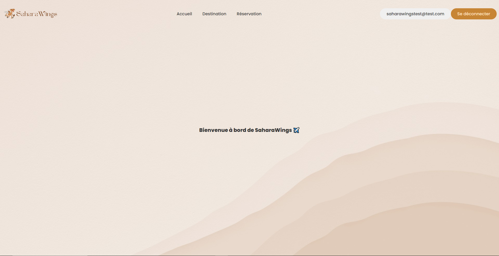
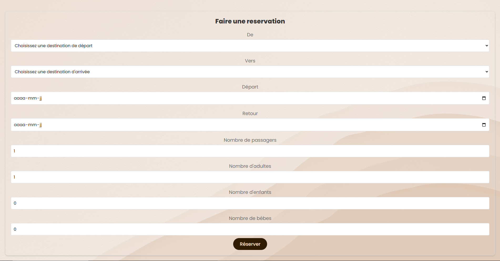

<div align='center'>
    <h1><b>✈️ [SaharaWings] ✈️</b></h1>
    
    <p>SaharaWings est une application web de réservation de vols pour une compagnie aérienne. Elle permet aux utilisateurs de créer un compte, de se connecter et de consulter leurs réservations de manière simple et rapide. L'application propose une interface conviviale pour consulter les détails d'un vol et effectuer des réservations en toute sécurité.</p>

</div>

---

## 💾 **FONCTIONNALITÉS**

**1. Gestion de compte utilisateur**
- Créer un compte : Les utilisateurs peuvent s'inscrire en fournissant leurs informations personnelles.
- Se connecter : Les utilisateurs peuvent se connecter à leur compte sécurisé pour accéder à leurs informations et réservations.
- Modifier le compte : Les utilisateurs peuvent mettre à jour leurs informations personnelles, telles que l'adresse e-mail, le mot de passe, ou d'autres détails.

**2. Réservation de vols**
- Réserver un vol : Les utilisateurs peuvent sélectionner leur vol préféré et effectuer une réservation.
- Consulter les détails d'un vol : Les utilisateurs peuvent voir les informations détaillées des vols réservés, y compris les horaires, les destinations et le nombre de passagers.
- Supprimer une réservation : Les utilisateurs peuvent annuler une réservation de vol directement depuis leur compte.

<br />

---

## 🗒️ **INSTALLATION**

### local installation:
*avoir Node.js installé
1. cloner le dépot

```
git clone https://github.com/username/depot
```

2. cd dans le dépot cloné

```
cd depot
```

3. installer les dépendances

```
cd frontend
npm install
```

```
cd backend
npm install
```

4. créer et configurer le fichier .env

```
MONG_URI=mongodb_url
PORT=4000
```

5. lancer l'application
```
dans le chemin {npm_app/backend}
npm start
```

```
dans le chemin {npm_app/frontend}
npm start
```

<br />

---

## 🔎 **APERÇU**




<br />

---


## 💻 **TECHNOLOGIES**


